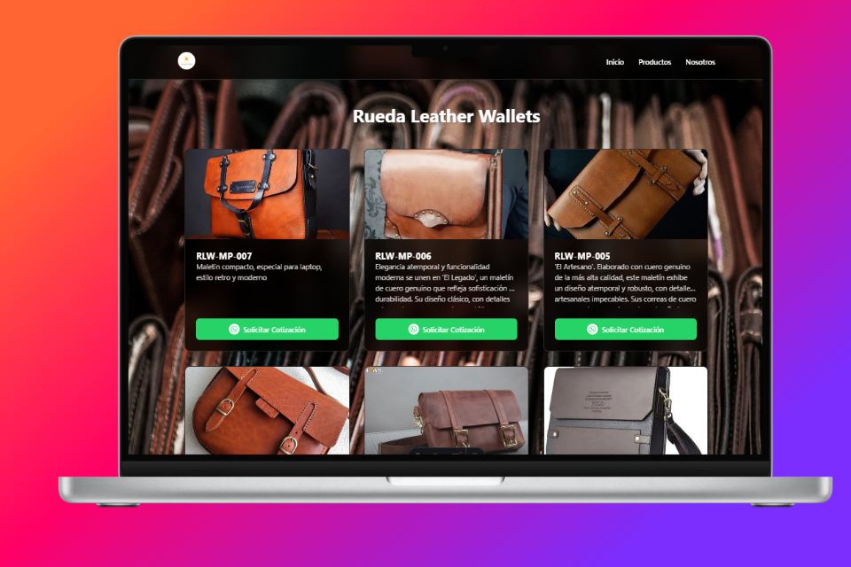
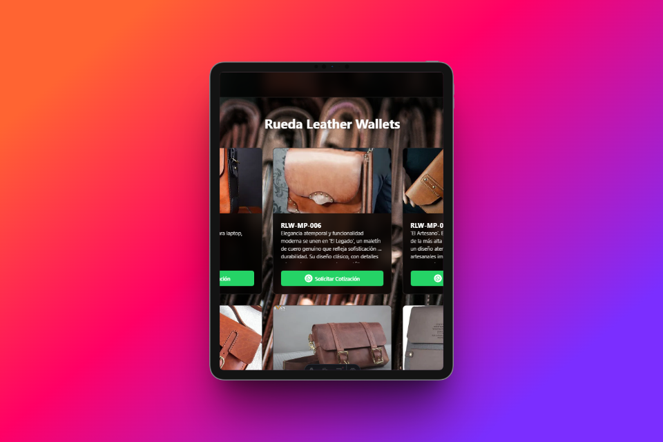
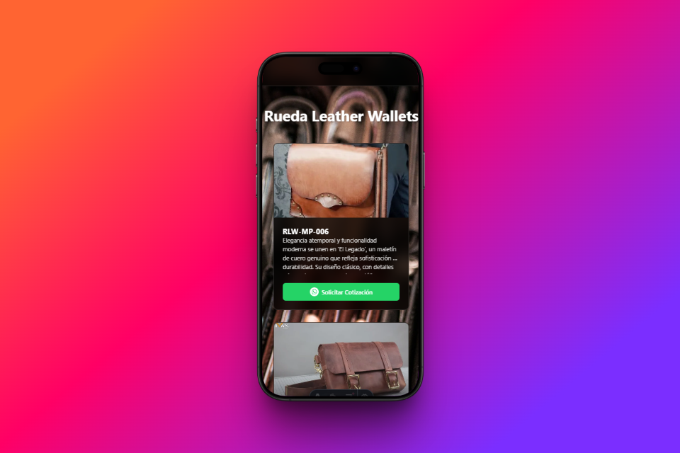
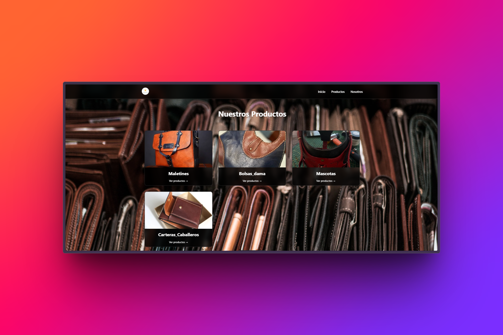
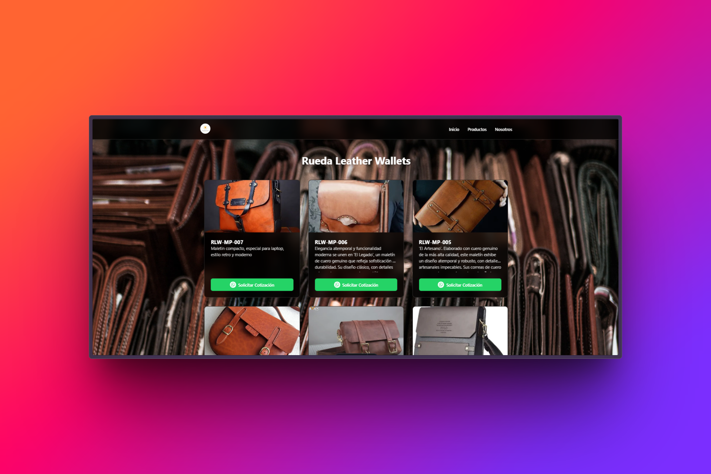
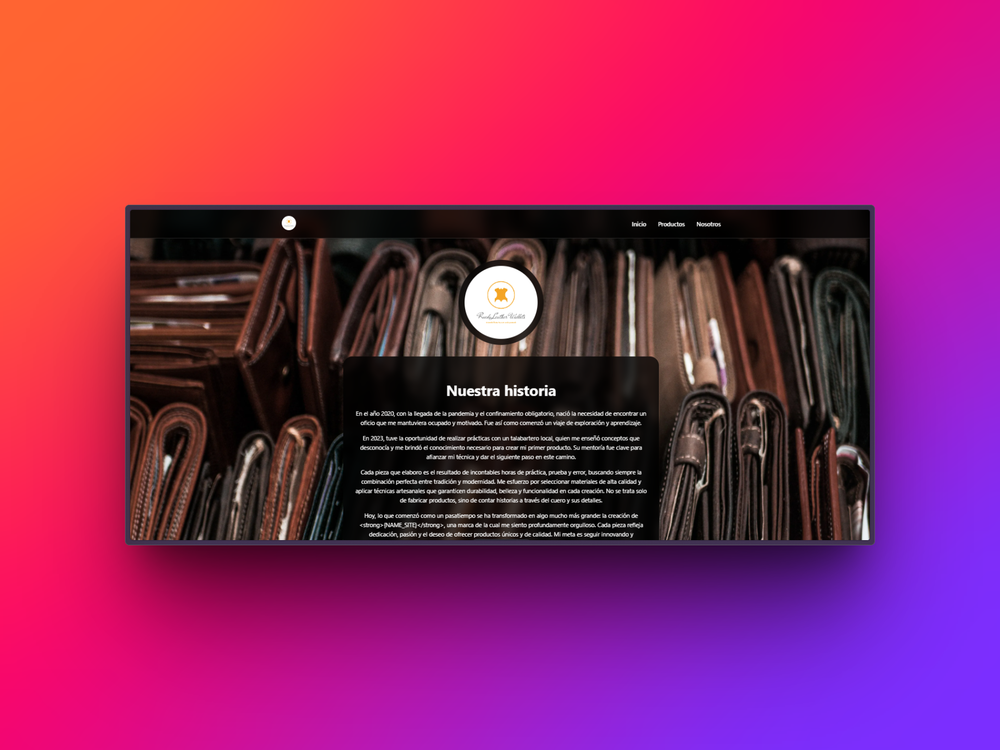

# Rueda Leather Wallets Catalogo

Este proyecto está construido utilizando **Astro**, un moderno *framework* para la creación de sitios web rápidos y eficientes. La estructura del proyecto incluye directorios como `/public` para archivos estáticos y `/src` para componentes y páginas, siguiendo las mejores prácticas de desarrollo web.

El repositorio también contiene archivos de configuración esenciales como `astro.config.mjs` y `tsconfig.json`, facilitando la personalización y el mantenimiento del sitio.

Este ***catálogo digital*** refleja el compromiso de la marca con la calidad y la artesanía, ofreciendo a los clientes una plataforma en línea para explorar y adquirir productos de cuero hechos a mano.

## Estructura del proyecto

Dentro de este proyecto se encuentra la siguiente estructura:

```text
├───📁 public/
│   ├───📁 image/
│   │   ├───📄 2741.webp
│   │   ├───📄 cominsoon.webp
│   │   ├───📄 fondo_carteras.webp
│   │   ├───📄 photo_2024-03-18_21-56-18.webp
│   │   ├───📄 photo_2024-03-18_22-20-22.webp
│   │   ├───📄 photo_2024-03-18_22-30-17.webp
│   │   ├───📄 photo_2024-03-18_23-05-35.webp
│   │   ├───📄 photo_2024-03-18_23-14-50.webp
│   │   ├───📄 photo_2024-03-18_23-50-44.webp
│   │   ├───📄 photo_2024-03-18_23-59-17.webp
│   │   ├───📄 photo_2024-03-19_00-00-51.webp
│   │   ├───📄 photo_2024-03-19_15-20-33.webp
│   │   ├───📄 photo_2024-03-31_11-49-30.webp
│   │   ├───📄 photo_2024-03-31_12-35-40.webp
│   │   ├───📄 photo_2024-03-31_12-38-12.webp
│   │   ├───📄 photo_2024-03-31_12-39-17.webp
│   │   ├───📄 photo_2024-03-31_12-50-13.webp
│   │   ├───📄 photo_2024-03-31_12-59-17.webp
│   │   ├───📄 photo_2024-04-08_10-10-10.webp
│   │   ├───📄 photo_2024-04-08_10-19-54.webp
│   │   ├───📄 photo_2024-05-09_16-51-26.webp
│   │   ├───📄 photo_2024-05-09_16-51-56.webp
│   │   └───📄 photo_2024-06-26_20-22-50.webp
│   ├───📄 apple-touch-icon.png
│   ├───📄 favicon-32x32.png
│   ├───📄 favicon-96x96.png
│   ├───📄 favicon.ico
│   ├───📄 favicon.svg
│   ├───📄 logo-color.png
│   ├───📄 logo-color.svg
│   ├───📄 logo-color.webp
│   ├───📄 site.webmanifest
│   ├───📄 web-app-manifest-192x192.png
│   └───📄 web-app-manifest-512x512.png
├───📁 src/
│   ├───📁 assets/
│   │   ├───📄 289shots_so.png
│   │   ├───📄 470_1x_shots_so.png
│   │   ├───📄 471shots_so.png
│   │   ├───📄 657_1x_shots_so.png
│   │   ├───📄 706_1x_shots_so.png
│   │   ├───📄 984shots_so.png
│   │   └───📄 background.svg
│   ├───📁 components/
│   ├───📁 data/
│   │   ├───📄 historia.json
│   │   ├───📄 NavLinks.json
│   │   ├───📄 Products.json
│   │   ├───📄 terminos-y-condiciones.json
│   │   └───📄 vision.json
│   ├───📁 layouts/
│   ├───📁 pages/
│   ├───📁 utils/
│   │          └───📄 categoryUtils.js
│   └───📄 const.ts
├───📄 package-lock.json
├───📄 package.json
├───📄 README.md
└───📄 tsconfig.json
```

## Autor

**Ivanruedas85**

## Galería







